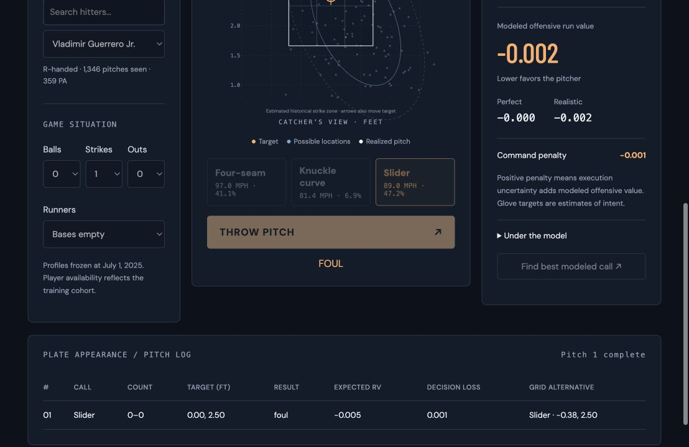

# Command Lab

**Call the pitch. Pick the target. Live with the miss.**

A working MLB pitch-calling research application that separates an estimated target from realized execution, then predicts hitter response. The included frozen 2025 models support **365 pitchers and 307 hitters**. All player profiles, command distributions and response probabilities derive from downloaded observations and fitted models; there is no synthetic demo roster.

**Status:** functional local research preview with temporal baseline evaluation. This is not yet a validated production coaching system. Public deployment has not been performed. GitHub publication is pending an accessible destination repository.



## Run locally

Python 3.9–3.11, with the pinned dependencies below. Model artifacts are included, so serving the application does not download a season or train a model.

```sh
python3 -m venv .venv
. .venv/bin/activate
pip install -r requirements-dev.txt
python -m unittest discover -s tests
uvicorn src.api:app --host 127.0.0.1 --port 8000
```

Open http://127.0.0.1:8000. The application needs no ChatGPT login. Google Fonts is optional; local font fallbacks preserve functionality offline. Only load the trusted bundled joblib artifact: Python model serialization is not safe for untrusted uploads.

## What works

- Search a broad, empirically eligible training cohort by player name.
- Choose only observed, sufficiently used pitcher repertoire pitches, with velocity and usage.
- Configure count, outs and base state; aim with a click or arrow keys.
- Inspect 50%/80% Gaussian landing regions, empirical sample support, mean miss and covariance.
- Toggle perfect execution and realistic execution using the same response models.
- Simulate reproducible realized locations, hitter responses and full plate appearances.
- Compare expected offensive run value and command penalty.
- Review calls with model-derived decision loss, candidate percentile, and best/worst calls.
- Explore repertoire-wide run-value, swing, whiff and command-penalty surfaces in Pro Mode.
- Read actual model selection and held-out results inside the application.

## Architecture

FastAPI serves a responsive HTML/CSS/JavaScript application and an in-memory inference engine. This avoids a separate Node build, duplicated frontend model logic and large downloads on interaction. Process-local bounded caching stores target surfaces. The core game-state machine is pure Python and independently tested.

The execution baseline models two-dimensional error from estimated pre-pitch **glove targets**, in inches. It shrinks pitcher/pitch means and second moments toward pitch type and league. It intentionally excludes the published OpenCommand inferred targets because their calibration is fit in-sample. This is an estimated-glove-target fallback, not verified intention measurement.

Regularized logistic heads estimate swing, called strike and conditional contact outcomes. Separate bounded ridge heads estimate exit velocity, launch angle and xwOBA. Run value uses a histogram-boosted tree with a player-aware linear feature produced by five-fold game-group cross-fitting. Location splines and pitch-type/hitter spatial interactions allow individualized responses. Player-agnostic and player-aware models compete on validation performance; the hit-category head selected the player-agnostic variant. No post-pitch outcome feature is supplied at inference. Pitch quality comes from training-period repertoire medians, not the future simulated pitch.

## Data and reproducibility

- [OpenCommand](https://github.com/tomdoyo/open-command), Tom Kim, v1.2.0 methodology; [data](https://huggingface.co/datasets/tomdoyo/open-command).
- [MLB Statcast CSV documentation](https://baseballsavant.mlb.com/csv-docs).
- MLB public game-feed identities bridge `(game_pk, play_id)` to Statcast `(game_pk, at_bat_number, pitch_number)`; one complete game has been explicitly verified.

The data audit preceded application construction. See [data audit](docs/data-audit.md), [methodology](docs/methodology.md), [build log](docs/build-log.md), and the generated JSON reports in `models/`.

Raw downloads are intentionally excluded from Git. To reproduce the current pipeline from public sources:

```sh
python scripts/download.py --out data/raw --year 2025
python scripts/download.py --out data/raw --year 2024
python scripts/download.py --out data/raw/statcast --year 2025 --statcast
python scripts/audit_baseline.py --data data/raw --out models
OPENBLAS_NUM_THREADS=2 OMP_NUM_THREADS=2 python scripts/train_hitter.py --data data/raw/statcast --out models
python scripts/resolve_players.py --players models/players.json
python scripts/improve_value.py --data data/raw/statcast
python scripts/target_support.py --data data/raw
python scripts/subgroup_audit.py --data data/raw
python scripts/research_report.py
```

Three-day Statcast batches explicitly reject the 25,000-row cap. Downloads use temporary files, bounded concurrency, retry limits and SHA256 manifests. Upstream feeds can be corrected after publication; compare your source hashes against `models/provenance/` and `models/audit.json` before claiming an identical reproduction. The included fitted artifacts preserve this release independently of mutable upstream data.

`verify_join.py` reproduces the recorded one-game identity audit from the source game JSON and Statcast sample; see `docs/methodology.md` for commands. Full-season response models train independently on Statcast, so a full-season target bridge is not required for this architecture and has not been claimed.

## Validation

Train: before July 1, 2025. Select: July. Test: August onward. The initial fitting run hit solver iteration limits; the same models were refitted to convergence with a larger iteration allowance. Test results were inspected during development, so a new external holdout is needed for confirmatory claims.

| Component | Held-out result | Comparison |
|---|---:|---:|
| Command negative log likelihood | 7.2649 | League 7.4506; pitch type 7.3754 |
| Command horizontal / vertical RMSE | 8.75″ / 10.45″ | League 8.98″ / 11.28″ |
| Command 50% / 80% coverage | 53.35% / 79.77% | Nominal 50% / 80% |
| Swing log loss | 0.4811 | Player-agnostic 0.4962 |
| Called-strike log loss | 0.1669 | Player-agnostic 0.1690 |
| Contact-category log loss | 1.0358 | Player-agnostic 1.0498 |
| Hit-category log loss | 0.9854 | Player-aware 0.9933 (not selected) |
| Exit-velocity RMSE | 14.04 mph | Mean-only 15.22 mph |
| Run-value RMSE | 0.22395 runs | Linear 0.22624; mean-only 0.22755 |

Lower loss/RMSE is better. The nonlinear value model improves prediction, but this does not prove better pitch-calling policy. An untouched September 1–12, 2026 window contains 47,502 pitches across 161 games: run-value RMSE is 0.22784 versus 0.23039 for the linear baseline. A game-clustered bootstrap estimates MSE reduction 0.001168 (95% interval 0.001048–0.001283). Coordinates were converted to the 2025 reference plane; ABS and behavioral drift remain. See `models/value-validation.json` and `models/external-validation.json`. Full Brier, calibration-bin, MAE and baseline details are in `models/response-validation.json`. Aggregate calibration does not establish player-level reliability.

## Local checks and deployment

21 unit/integration tests pass: counts, terminal states, foul tips, identity bridge, probability sums, sampling reproducibility, target interactions, eligibility, API validation and real player metadata. Browser checks covered a completed Cease–Guerrero plate appearance, both execution modes, optimizer, methodology and a 390px mobile layout. No console errors were observed.

One local measurement: 24 ms for a single analysis, 308 ms for an uncached 297-candidate search. These are in-process timings on this machine, not load-test results or service guarantees.

A Dockerfile and GitHub Actions test workflow are included. Docker is unavailable on the build machine, so the container recipe is untested. A Python/container host can expose port 8000 behind TLS. The request forbids deployment before solid validation; public release is therefore deferred pending the model/measurement gates below and hosting access.

## Remaining production gates

1. Independent target-quality evaluation and measurement-error sensitivity. Subgroup containment is now measured and exposed; some pitchers remain poorly calibrated.
2. Expand the completed 12-day 2026 external check to wider season coverage; plate conversion does not remove ABS behavioral changes.
3. Improve contact-category calibration and uncertainty beyond Monte Carlo integration; the value head now includes validated nonlinear and cross-fitted alternatives.
4. Demonstrated value of optimizing the model, with appropriate observational-policy evaluation; no causal improvement is claimed.
5. Calibrated risk metrics, model-drift/update checks, load testing and a tested deployment. Target recommendations now require at least 20 nearby training observations.

Not implemented: validated sequencing, causal policy improvement, calibrated catastrophic-miss risk, launch-angle sampling, HBP/bunt/automatic-ball simulation, or league-wide empirical research conclusions. There are no invented substitutes for these features.

## Repository

```text
app/       responsive simulator, Pro Mode, methodology
src/       preprocessing, inference, API, count transitions
scripts/   downloads, audits, training, names, example analysis
models/    compact fitted artifacts, reports and source manifests
tests/     critical game, model and API tests
docs/      methodology, audit, build log and project report
```

OpenCommand-derived artifacts are noncommercial and share-alike; see [LICENSE.md](LICENSE.md). This application is not affiliated with MLB.
